## Exercise 2: Develop and publish the photo processing and data export functions

**Duration**: 45 minutes

Use Visual Studio and its integrated Azure Functions tooling to develop and debug the functions locally, and then publish them to Azure. The starter project solution, TollBooths, contains most of the code needed. You will add in the missing code before deploying to Azure.

### Task 1: Create a system-assigned managed identity for your Function App to connect to Key Vault

In order for your Function App to be able to access Key Vault to read the secrets, you must **create a system-assigned managed identity** for the Function App, and **create an access policy in Key Vault** for the application identity.

1. Open the **serverless-architecture-DID** resource group, and then select the Azure Function App you created whose name ends with **FunctionApp-DID**. This is the one you created using the **.NET Core** runtime stack. If you did not use this naming convention, that's fine. Just be sure to make note of the name so you can distinguish it from the Function App you will be developing using the portal later on.

   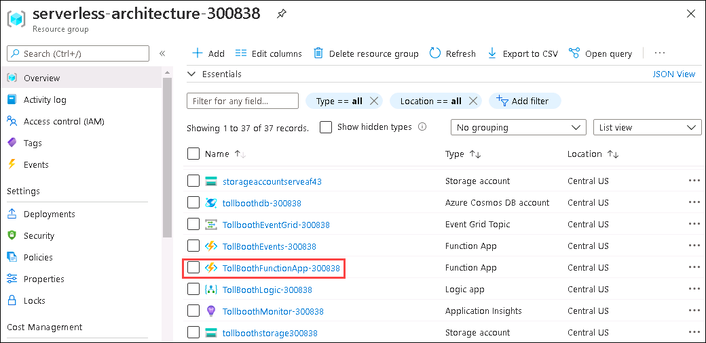
   
2. Under **Settings** pane select **Identity**.

   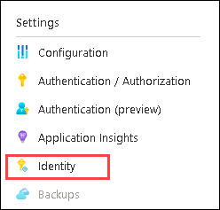
  
3. Within the **System assigned** tab, switch **Status** to **On**. Select **Save**.

   

### Task 2: Configure application settings

In this task, you will apply application settings using the Microsoft Azure Portal.

1. Select **Configuration** under the **Settings** pane and click on **Application settings** section. 

   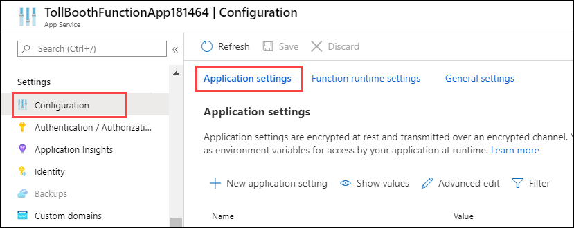

2. Use the **+ New application setting** link to create the following additional Key/Value pairs (the key names must exactly match those found in the table below). **Be sure to remove the curly braces (`{}`)**.

    |                          |                                                                                                                                                             |
    | ------------------------ | :---------------------------------------------------------------------------------------------------------------------------------------------------------: |
    | **Application Key**      |                                                                          **Value**                                                                          |
    | computerVisionApiUrl     | Computer Vision API endpoint you copied earlier. Append **vision/v2.0/ocr** to the end. Example: `https://<YOUR-SERVICE-NAME>.cognitiveservices.azure.com/vision/v2.0/ocr` |
    | computerVisionApiKey     |                                                                   Enter `@Microsoft.KeyVault(SecretUri={referenceString})`, where `{referenceString}` is the URI for the **computerVisionApiKey** Key Vault secret                                                                   |
    | eventGridTopicEndpoint   |                                                                  Event Grid Topic endpoint                                                                  |
    | eventGridTopicKey        |                                                                 Enter `@Microsoft.KeyVault(SecretUri={referenceString})`, where `{referenceString}` is the URI for the **eventGridTopicKey** Key Vault secret                                                                 |
    | cosmosDBEndPointUrl      |                                                                        Cosmos DB URI                                                                        |
    | cosmosDBAuthorizationKey |                                                                    Enter `@Microsoft.KeyVault(SecretUri={referenceString})`, where `{referenceString}` is the URI for the **cosmosDBAuthorizationKey** Key Vault secret                                                                    |
    | cosmosDBDatabaseId       |                                                            Cosmos DB database id (LicensePlates)                                                            |
    | cosmosDBCollectionId     |                                                        Cosmos DB processed collection id (Processed)                                                        |
    | exportCsvContainerName   |                                                       Blob storage CSV export container name (export)                                                       |
    | blobStorageConnection    |                                                               Enter `@Microsoft.KeyVault(SecretUri={referenceString})`, where `{referenceString}` is the URI for the **blobStorageConnection** Key Vault secret      

    

3. Select **Save**.

    

### Task 3: Add Function App to Key Vault access policy

Perform these steps to create an access policy that enables the "Get" secret permission:

1. Open your Key Vault service.

2. Select **Access policies**.

3. Select **+ Add Access Policy**.

   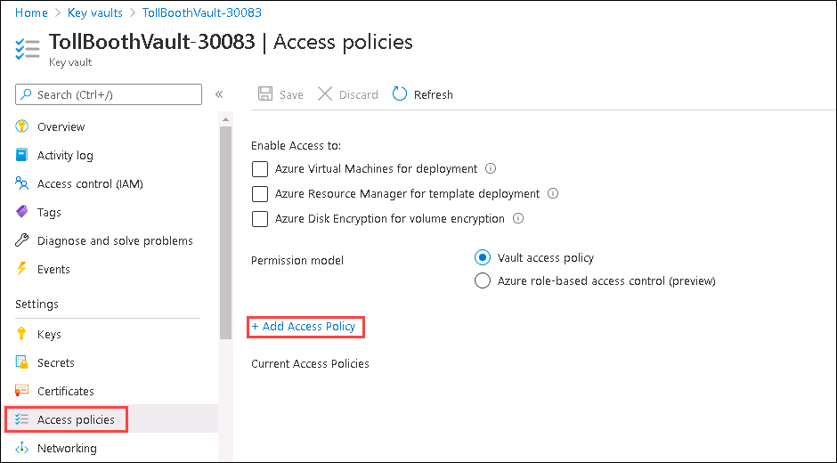

4. Select the **Select principal** section on the Add access policy form.

    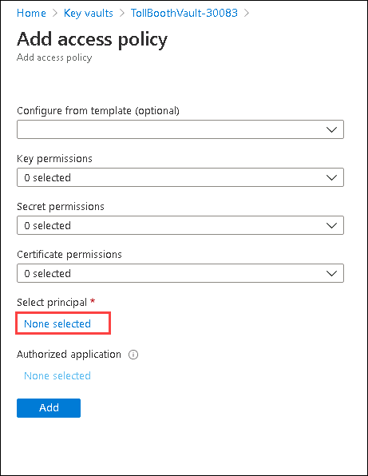

5. In the Principal blade, search for your TollBoothFunctionApp Function App's service principal. Enter **TollBooth** in the search box and select it, then click on the **Select** button.

   

6. Expand the **Secret permissions** and check **Get** under Secret Management Operations.

    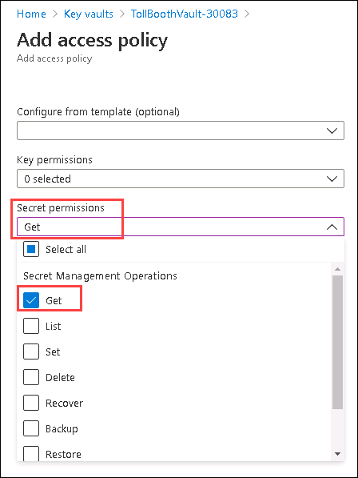

7. Select **Add** to add the new access policy.

8. When you are done, you should have an access policy for the Function App's managed identity. Select **Save** to finish the process.

   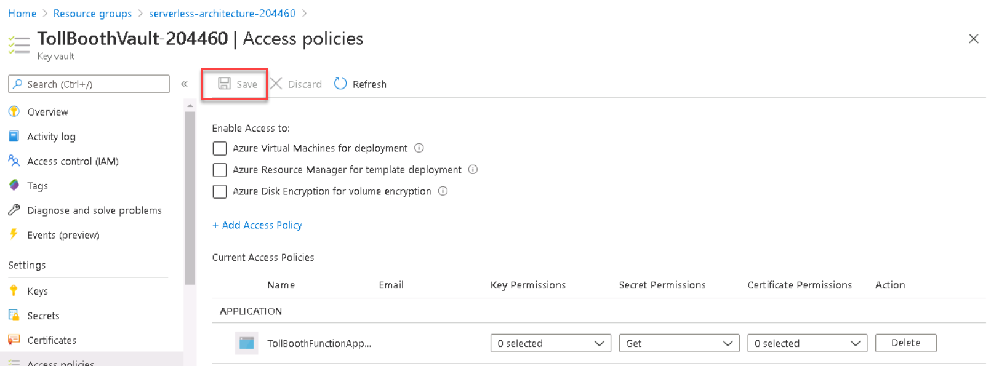

### Task 4: Finish the ProcessImage function

There are a few components within the starter project that must be completed, marked as TODO in the code. The first set of TODO items we will address are in the ProcessImage function, the FindLicensePlateText class that calls the Computer Vision API, and finally the SendToEventGrid.cs class, which is responsible for sending processing results to the Event Grid topic you created earlier.

> **Note:** Do **NOT** update the version of any NuGet package. This solution is built to function with the NuGet package versions currently defined within. Updating these packages to newer versions could cause unexpected results.

1. Navigate to the **TollBooth** project directory `C:\ServerlessMCW\MCW-Serverless-architecture-master\hands-on-lab\starter\TollBooth\` using the file Explorer and open ```TollBooth.sln``` file. 

   

2. When you open the ```TollBooth.sln``` file, it will launch the visual studio **Sign in** window. Click on **Sign in**.

   
   
3. Enter the following Azure credentials to **Sign in** to visual Studio. 

   

4. Click on **Start Visual Studio** to start the visual studio and work on the solution code.

   

5. From the Visual Studio **View** menu, select **Task List**.

    

6. There you will see a list of TODO tasks, where each task represents one line of code that needs to be completed.

    

7. Open **ProcessImage.cs**. Notice that the Run method is decorated with the FunctionName attribute, which sets the name of the Azure Function to "ProcessImage". This is triggered by HTTP requests sent to it from the Event Grid service. You tell Event Grid that you want to get these notifications at your function's URL by creating an event subscription, which you will do in a later task, in which you subscribe to blob-created events. The function's trigger watches for new blobs being added to the images container of the storage account that was created in Exercise 1. The data passed to the function from the Event Grid notification includes the URL of the blob. That URL is in turn passed to the input binding to obtain the uploaded image from Blob storage.

   
   
8. The following code represents the completed task in ProcessImage.cs:

    ```csharp
    // **TODO 1: Set the licensePlateText value by awaiting a new FindLicensePlateText.GetLicensePlate method.**

    licensePlateText = await new FindLicensePlateText(log, _client).GetLicensePlate(licensePlateImage);
    ```
    
    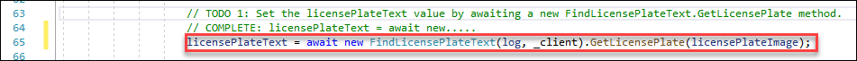

9. Open **FindLicensePlateText.cs**. This class is responsible for contacting the Computer Vision API to find and extract the license plate text from the photo, using OCR. Notice that this class also shows how you can implement a resilience pattern using [Polly](https://github.com/App-vNext/Polly), an open source .NET library that helps you handle transient errors. This is useful for ensuring that you do not overload downstream services, in this case, the Computer Vision API. This will be demonstrated later on when visualizing the Function's scalability.

   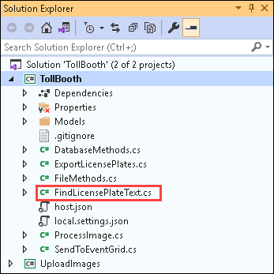
  
10. The following code represents the completed task in FindLicensePlateText.cs:

    ```csharp
    // TODO 2: Populate the below two variables with the correct AppSettings properties.
    var uriBase = Environment.GetEnvironmentVariable("computerVisionApiUrl");
    var apiKey = Environment.GetEnvironmentVariable("computerVisionApiKey");
    ```
    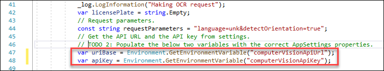

11. Open **SendToEventGrid.cs**. This class is responsible for sending an Event to the Event Grid topic, including the event type and license plate data. Event listeners will use the event type to filter and act on the events they need to process. Make note of the event types defined here (the first parameter passed into the Send method), as they will be used later on when creating new functions in the second Function App you provisioned earlier.

     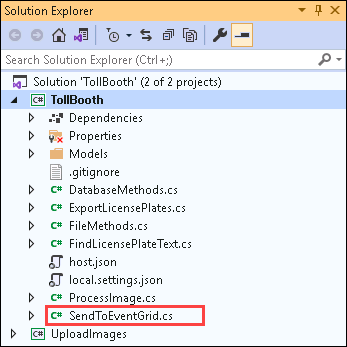
  
12. The following code represents the completed tasks in `SendToEventGrid.cs`:

    ```csharp
    // TODO 3: Modify send method to include the proper eventType name value for saving plate data.
    await Send("savePlateData", "TollBooth/CustomerService", data);

    // TODO 4: Modify send method to include the proper eventType name value for queuing plate for manual review.
    await Send("queuePlateForManualCheckup", "TollBooth/CustomerService", data);
    ```
    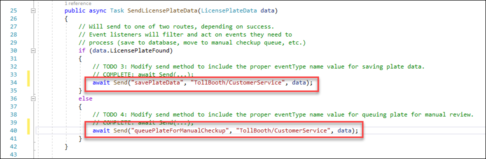

    > **Note**: TODOs 5, 6, and 7 will be completed in later steps of the guide.

### Task 5: Publish the Function App from Visual Studio

In this task, you will publish the Function App from the starter project in Visual Studio to the existing Function App you provisioned in Azure.

1. Navigate to the **TollBooth** project using the Solution Explorer of Visual Studio.

2. Right-click the **TollBooth** project and select **Publish** from the context menu.

    

3. In the Publish window, select **Azure**, then select **Next**.

    

    > **Note**: If you do not see the ability to publish to an Azure Function, you may need to update your Visual Studio instance.

4. In the App Service form, select your **Subscription**, select **Resource Group** under **View**, then expand your **serverless-architecture-DID** resource group and select the Function App whose name ends with **FunctionApp**. Finally, **uncheck the `Run from package file` option**.

5. Whatever you named the Function App when you provisioned it is fine. Just make sure it is the same one to which you applied the Application Settings in Task 1 of this exercise.

    

    > **Note**: We do not want to run from a package file, because when we deploy from GitHub later on, the build process will be skipped if the Function App is configured for a zip deployment.

6. After you select the Function App, select **Finish**.

    > **Note**: If prompted to update the functions version on Azure, select **Yes**.

7. Select **Publish** to start the process. Watch the Output window in Visual Studio as the Function App publishes. When it is finished, you should see a message that says, `========== Publish: 1 succeeded, 0 failed, 0 skipped ==========`.

    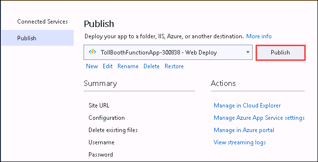

8. Using a new tab or instance of your browser navigate to the Azure portal, <http://portal.azure.com>.

9. Open the **serverless-architecture-DID** resource group, then select the Azure Function App to which you just published.

10. Select **Functions** in the left-hand menu. You should see both functions you just published from the Visual Studio solution listed.

    

11. Now we need to add an Event Grid subscription to the ProcessImage function, so the function is triggered when new images are added to blob storage. Select the **ProcessImage** function, select **Integration** on the left-hand menu, select **Event Grid Trigger (eventGridEvent)**, then select **Create Event Grid subscription**.

    

12. On the **Create Event Subscription** blade, specify the following configuration options:

    a. **Name**: Unique value for the App name similar to **processimagesub** (ensure the green check mark appears).

    b. **Event Schema**: Select Event Grid Schema.

    c. For **Topic Type**, select **Storage Accounts (Blob & GPv2)**.

    d. Select your **subscription** and **serverless-architecture-DID** resource group.

    e. For resource, select your recently created storage account. Enter **processimagesubtopic** into the System Topic Name field.

    f. Select only the **Blob Created** from the event types dropdown list.

    g. Leave Azure Function as the Endpoint Type.

13. Leave the remaining fields at their default values and select **Create**.

    
