## Exercise 3: Create functions in the portal

**Duration**: 45 minutes

Create two new Azure Functions written in Node.js, using the Azure portal. These will be triggered by Event Grid and output to Azure Cosmos DB to save the results of license plate processing done by the ProcessImage function.

### Task 1: Create function to save license plate data to Azure Cosmos DB

In this task, you will create a new Node.js function triggered by Event Grid and that outputs successfully processed license plate data to Azure Cosmos DB.

1. Using a new tab or instance of your browser navigate to the Azure portal, ```http://portal.azure.com```.

2. Open the **serverless-architecture-DID** resource group, then select the Azure Function App you created whose name ends with **Events**. If you did not use this naming convention, make sure you select the Function App that you _did not_ deploy to in the previous exercise.

3. In the blade menu, select **Functions**, the select **+ New Function**.

   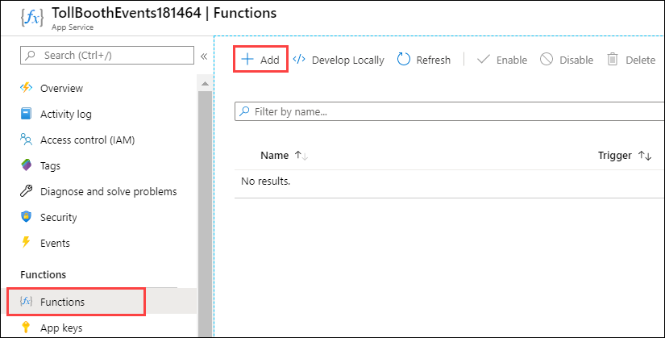

4. Enter **event grid** into the template search form, then select the **Azure Event Grid trigger** template.

   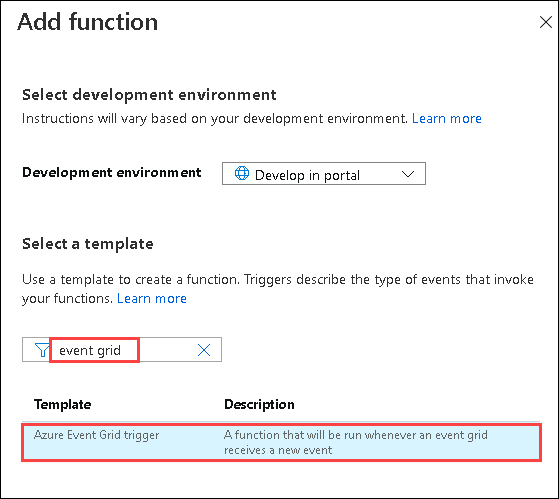

5. Scroll down on the **Add function** blade, enter **SavePlateData** for the **Name**, then select **Add**.

   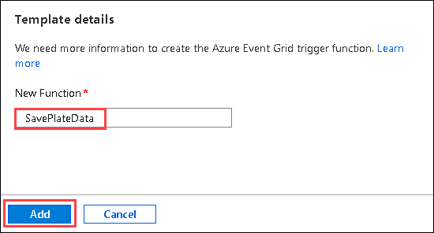

6. Replace the code in the new SavePlateData function with the following:

    ```javascript
    module.exports = function(context, eventGridEvent) {
        context.log(typeof eventGridEvent);
        context.log(eventGridEvent);

        context.bindings.outputDocument = {
            fileName: eventGridEvent.data['fileName'],
            licensePlateText: eventGridEvent.data['licensePlateText'],
            timeStamp: eventGridEvent.data['timeStamp'],
            exported: false
        };

        context.done();
    };
    ```

7. Select **Save**.

8. On saving the code, logs window may appear. For now ignore the warning as we will work on it in next exercise.

   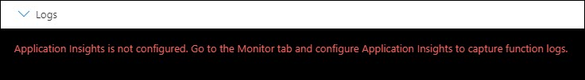

### Task 2: Add an Event Grid subscription to the SavePlateData function

In this task, you will add an Event Grid subscription to the SavePlateData function. This will ensure that the events sent to the Event Grid topic containing the savePlateData event type are routed to this function.

1. With the SavePlateData function open, select **Integration** in the left-hand menu, select **Event Grid Trigger (eventGridEvent)**, then select **Create Event Grid subscription**.

    

2. On the **Create Event Subscription** blade, specify the following configuration options:

    a. **Name**: Unique value for the App name similar to **saveplatedatasub** (ensure the green check mark appears).

    b. **Event Schema**: Select **Event Grid Schema**.

    c. For **Topic Type**, select **Event Grid Topics**.

    d. Select your **Subscription** and **serverless-architecture-DID** resource group.

    e. For resource, select your recently created Event Grid.

    f. For Event Types, select **Add Event Type**.

    g. Enter `savePlateData` for the new event type value. This will ensure this function is only triggered by this Event Grid type.

    h. Leave Azure Function as the Endpoint Type.
    
3. Review all the values and select **Create**.

    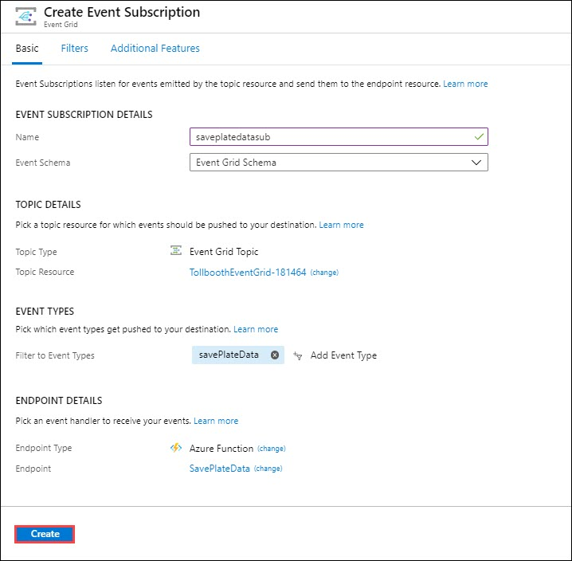

### Task 3: Add an Azure Cosmos DB output to the SavePlateData function

In this task, you will add an Azure Cosmos DB output binding to the SavePlateData function, enabling it to save its data to the Processed collection.

1. Go to the function app whose name ends with **Events**. Then click on Functions and select the **SavePlateData** function. 
  
   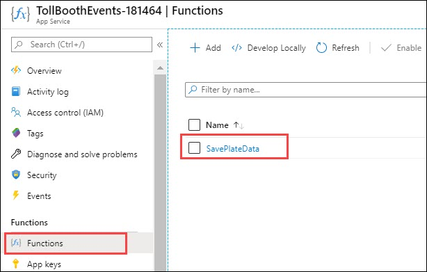
   
2. Now click on **Integration** under **Developer** pane and click on **+Add Output**.

   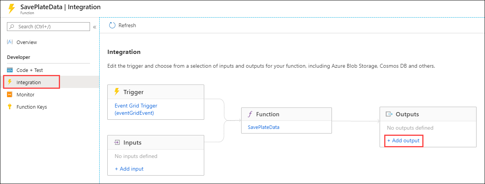

3. Add following configurtaions from the dropdown:

      - Binding Type: **Azure Cosmos DB**
       
      - Document parameter name: Leave to default
       
      - Database Name: **LicensePlates**
       
      - Collection Name: **Processed**
 
      - If true, creates the Cosmos DB database and collection : Select **Yes**
       
      - Cosmos DB account connection: Click on **New** and select **Azure Cosmos DB Account**. Leave Database Account on default as it will be set on your Cosmos DB account and then select **OK**.

   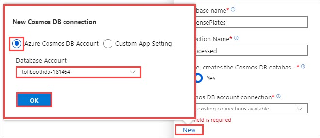

4. Now select **OK** to finally add the output.

   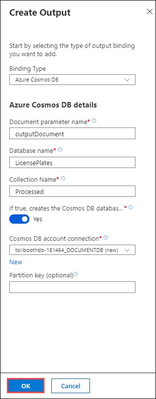

### Task 4: Create function to save manual verification info to Azure Cosmos DB

In this task, you will create a new function triggered by Event Grid and outputs information about photos that need to be manually verified to Azure Cosmos DB.

1. Open the **serverless-architecture-DID** resource group, then select the Azure Function App you created whose name ends with **Events**. If you did not use this naming convention, make sure you select the Function App that you _did not_ deploy to in the previous exercise.

2. In the blade menu, select **Functions**, the select **+ New Function**.

   

3. Enter **event grid** into the template search form, then select the **Azure Event Grid trigger** template.

   

4. Scroll down on the **Add function** blade, enter **QueuePlateForManualCheckup** for the **Name**, then select **Add**.

   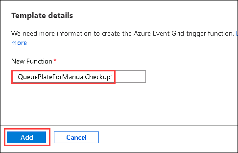

5. Replace the code in the new QueuePlateForManualCheckup function with the following:

    ```javascript
    module.exports = async function(context, eventGridEvent) {
        context.log(typeof eventGridEvent);
        context.log(eventGridEvent);

        context.bindings.outputDocument = {
            fileName: eventGridEvent.data['fileName'],
            licensePlateText: '',
            timeStamp: eventGridEvent.data['timeStamp'],
            resolved: false
        };

        context.done();
    };
    ```

6. Select **Save**.

7. On saving the code, logs window may appear. For now ignore the warning as we will work on it in next exercise.

   

### Task 5: Add an Event Grid subscription to the QueuePlateForManualCheckup function

In this task, you will add an Event Grid subscription to the QueuePlateForManualCheckup function. This will ensure that the events sent to the Event Grid topic containing the queuePlateForManualCheckup event type are routed to this function.

1. With the QueuePlateForManualCheckup function open, select Integration in the left-hand menu, select Event Grid Trigger (eventGridEvent), then select Create Event Grid subscription.

    

2. On the **Create Event Subscription** blade, specify the following configuration options:

    a. **Name**: Unique value for the App name similar to **queueplateformanualcheckupsub** (ensure the green check mark appears).

    b. **Event Schema**: Select **Event Grid Schema**.

    c. For **Topic Type**, select **Event Grid Topics**.

    d. Select your **Subscription** and **serverless-architecture-DID** resource group.

    e. For resource, select your recently created Event Grid.

    f. For Event Types, select **Add Event Type**.

    g. Enter `queuePlateForManualCheckup` for the new event type value. This will ensure this function is only triggered by this Event Grid type.

    h. Leave Azure Function as the Endpoint Type.
    
3. Review all the values and select **Create**.

   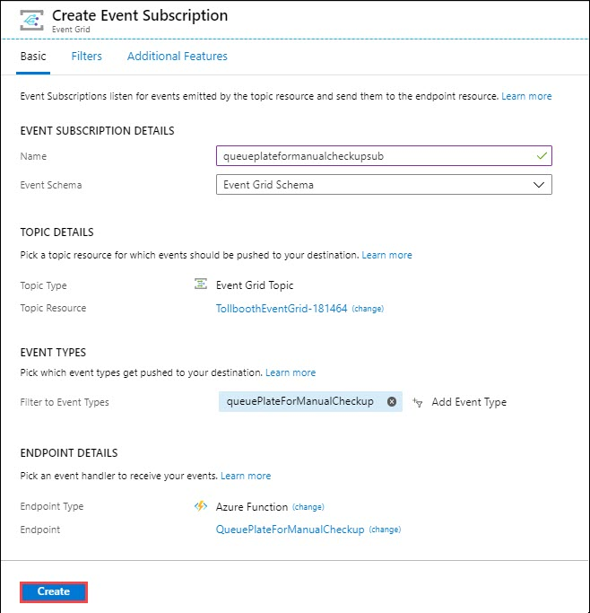

### Task 6: Add an Azure Cosmos DB output to the QueuePlateForManualCheckup function

In this task, you will add an Azure Cosmos DB output binding to the QueuePlateForManualCheckup function, enabling it to save its data to the NeedsManualReview collection.

1. Select the QueuePlateForManualCheckup function, then select **Integration** under **Developer** pane and click on **+Add Output**.

   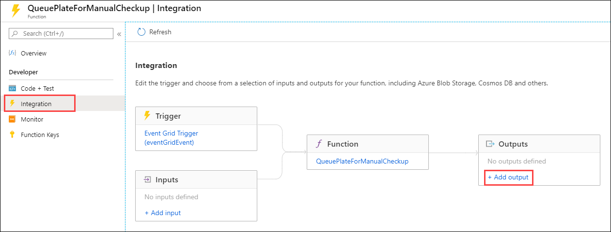

3. Add following configurtaions from the dropdown:

      - Binding Type: **Azure Cosmos DB**
       
      - Document parameter name: Leave to default
       
      - Database Name: **LicensePlates**
       
      - Collection Name: **NeedsManualReview**

      - If true, creates the Cosmos DB database and collection : Select **Yes**
       
      - Cosmos DB account connection: Click on **New** and select **Azure Cosmos DB Account**. Leave Database Account on default as it will be set on your Cosmos DB account and then select **OK**.

   

4. Now select **OK** to finally add the output.

   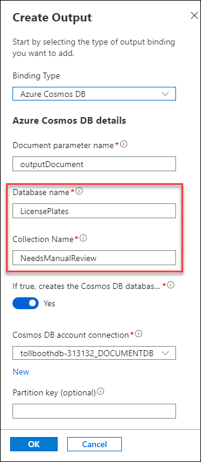

