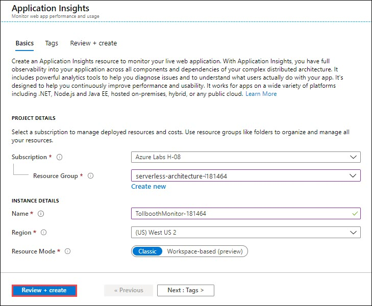
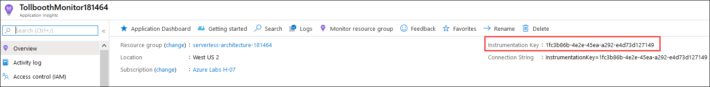
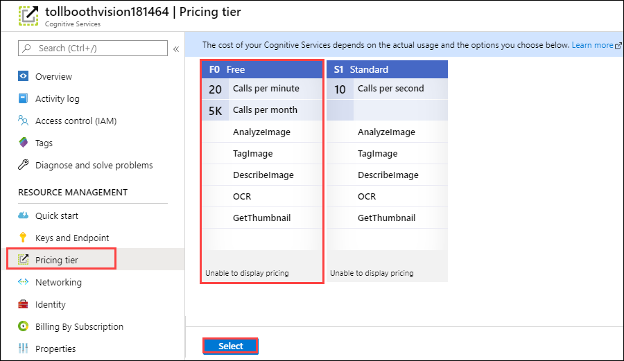

## Exercise 4: Monitor your functions with Application Insights

**Duration**: 45 minutes

Application Insights can be integrated with Azure Function Apps to provide robust monitoring for your functions. In this exercise, you will provision a new Application Insights account and configure your Function Apps to send telemetry to it.

### Task 1: Provision an Application Insights instance

1. Navigate to the Azure portal, ```http://portal.azure.com```.

2. Select **+ Create a resource**, then type **application insights** into the search box on top. Select **Application Insights** from the results.

    

3. Select the **Create** button on the **Application Insights overview** blade.

4. On the **Application Insights** blade, specify the following configuration options:

    a. **Name**: Unique value for the App name similar to **TollboothMonitor-DID** (ensure the green check mark appears).

    b. Select the **Resource Group** **ServerlessArchitecture**.

    c. Select the same **Location** as your Resource Group region.

   

5. Select **Review + Create**, then choose **Create**.

### Task 2: Enable Application Insights integration in your Function Apps

Both of the Function Apps need to be updated with the Application Insights instrumentation key so they can start sending telemetry to your new instance.

1. After the Application Insights account has completed provisioning, open the instance by opening the **ServerlessArchitecture** resource group, and then selecting the your recently created application insights instance.

2. Copy the **Instrumentation Key** from the Essentials section of the **Overview** blade.

    > **Note**: You may need to expand the **Essentials** section.

   

3. Open the Azure Function App you created whose name ends with **FunctionApp**, or the name you specified for the Function App containing the ProcessImage function.

4. Select **Configuration** on the **Overview** pane.

5. Scroll down to the **Application settings** section. Use the **+ Add new setting** link and name the new setting **APPINSIGHTS_INSTRUMENTATIONKEY**. Paste the copied instrumentation key into its value field.

    

6. Select **OK**.

7. Select **Save**.

    

8. Follow the steps above to add the APPINSIGHTS_INSTRUMENTATIONKEY setting to the function app that ends in **Events**.

### Task 3: Use the Live Metrics Stream to monitor functions in real time

Now that Application Insights has been integrated into your Function Apps, you can use the Live Metrics Stream to see the functions' telemetry in real time.

1. Open the Azure Function App you created whose name ends with **FunctionApp**, or the name you specified for the Function App containing the ProcessImage function.

2. Select **Application Insights** on the Overview pane.

    > **Note**: It may take a few minutes for this link to display. Try refreshing the page after a few moments.

    

3. In Application Insights, select **Live Metrics Stream** underneath Investigate in the menu.

    

4. Leave the Live Metrics Stream open and go back to the starter app solution in Visual Studio.

5. Navigate to the **UploadImages** project using the Solution Explorer of Visual Studio. Right-click on **UploadImages**, then select **Properties**.

    

6. Select **Debug** in the left-hand menu, then paste the connection string for your Blob storage account into the **Command line arguments** text field. This will ensure that the required connection string is added as an argument each time you run the application. Additionally, the combination of adding the value here and the `.gitignore` file included in the project directory will prevent the sensitive connection string from being added to your source code repository in a later step.

    

7. Save your changes.

8. Right-click the **UploadImages** project in the Solution Explorer, then select **Debug** then **Start new instance** from the context menu.

    

9. When the console window appears, enter **1** and press **ENTER**. This uploads a handful of car photos to the images container of your Blob storage account.

    

10. Switch back to your browser window with the Live Metrics Stream still open within Application Insights. You should start seeing new telemetry arrive, showing the number of servers online, the incoming request rate, CPU process amount, etc. You can select some of the sample telemetry in the list to the side to view output data.

    

11. Leave the Live Metrics Stream window open once again, and close the console window for the image upload. Debug the UploadImages project again, then enter **2** and press **ENTER**. This will upload 1,000 new photos.

    

12. Switch back to the Live Metrics Stream window and observe the activity as the photos are uploaded. It is possible that the process will run so efficiently that no more than two servers will be allocated at a time. You should also notice things such as a steady cadence for the Request Rate monitor, the Request Duration hovering below \~500ms second, and the Process CPU percentage roughly matching the Request Rate.

    

13. After this has run for a while, close the image upload console window once again, but leave the Live Metrics Stream window open.

### Task 4: Observe your functions dynamically scaling when resource-constrained

In this task, you will change the Computer Vision API to the Free tier. This will limit the number of requests to the OCR service to 10 per minute. Once changed, run the UploadImages console app to upload 1,000 images again. The resiliency policy programmed into the FindLicensePlateText.MakeOCRRequest method of the ProcessImage function will begin exponentially backing off requests to the Computer Vision API, allowing it to recover and lift the rate limit. This intentional delay will greatly increase the function's response time, thus causing the Consumption plan's dynamic scaling to kick in, allocating several more servers. You will watch all of this happen in real time using the Live Metrics Stream view.

1. Open your Computer Vision API service by opening the **ServerlessArchitecture** resource group, and then selecting the **Cognitive Services** service name.

2. Select **Pricing tier** under Resource Management in the menu. Select the **F0 Free** pricing tier, then choose **Select**.

    > **Note**: If you already have an **F0** free pricing tier instance, you will not be able to create another one.



3. Switch to Visual Studio, debug the **UploadImages** project again, then enter **2** and press **ENTER**. This will upload 1,000 new photos.

    

4. Switch back to the Live Metrics Stream window and observe the activity as the photos are uploaded. After running for a couple of minutes, you should start to notice a few things. The Request Duration will start to increase over time. As this happens, you should notice more servers being brought online. Each time a server is brought online, you should see a message in the Sample Telemetry stating that it is "Generating 2 job function(s)", followed by a Starting Host message. You should also see messages logged by the resilience policy that the Computer Vision API server is throttling the requests. This is known by the response codes sent back from the service (429). A sample message is "Computer Vision API server is throttling our requests. Automatically delaying for 32000ms".

    > **Note**: If you do not see data flow after a short period, consider restarting the Function App.

    

5. After this has run for some time, close the UploadImages console to stop uploading photos.

6. Navigate back to the **Computer Vision** API and set the pricing tier back to **S1 Standard**.

