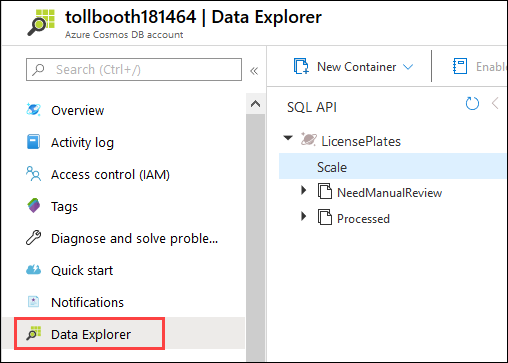

  ## Exercise 5: Explore your data in Azure Cosmos DB

**Duration**: 15 minutes

In this exercise, you will use the Azure Cosmos DB Data Explorer in the portal to view saved license plate data.

### Help references

|                       |                                                           |
| --------------------- | :-------------------------------------------------------: |
| **Description**       |                         **Links**                         |
| About Azure Cosmos DB | <https://docs.microsoft.com/azure/cosmos-db/introduction> |

### Task 1: Use the Azure Cosmos DB Data Explorer

1. Open your Azure Cosmos DB account by opening the **ServerlessArchitecture** resource group, and then selecting the **Azure Cosmos DB account** name.

2. Select **Data Explorer** from the menu.

   

3. Expand the **Processed** collection, then select **Items**. This will list each of the JSON documents added to the collection.

4. Select one of the documents to view its contents. The first four properties are ones that were added by your functions. The remaining properties are standard and are assigned by Cosmos DB.

    

5. Expand the **NeedsManualReview** collection, then select **Items**.

6. Select one of the documents to view its contents. Notice that the filename is provided, as well as a property named "resolved". While this is out of scope for this lab, those properties can be used together to provide a manual process for viewing the photo and entering the license plate.

    

7. Select the ellipses (...) next to the **Processed** collection and select **New SQL Query**.

    

8. Modify the SQL query to count the number of processed documents that have not been exported:

    ```sql
    SELECT VALUE COUNT(1) FROM c WHERE c.exported = false
    ```

9. Execute the query and observe the results. In our case, we have 669 processed documents that need to be exported.

    

