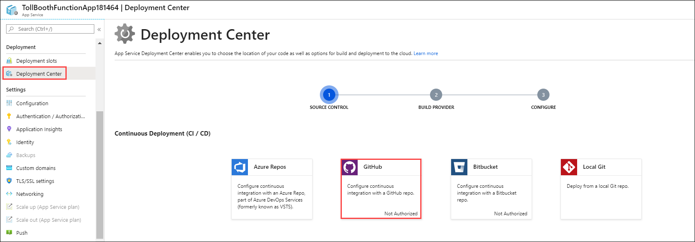

## Exercise 7: Configure continuous deployment for your Function App

**Duration**: 40 minutes

In this exercise, configure your Function App that contains the ProcessImage function for continuous deployment. You will first set up a GitHub source code repository, then set that as the deployment source for the Function App.

### Task 1: Add git repository to your Visual Studio solution and deploy to GitHub

1. Open the **TollBooth** project in Visual Studio.

2. Right-click the **TollBooth** solution in Solution Explorer, then select **Add Solution to Source Control**.

    

3. Select **View** in Visual Studio's top menu, then select **Team Explorer**.

    

4. Commit **all pending code changes** before continuing. To do this, right-click the **TollBooth** solution in Solution Explorer, then select **Commit...**.

    

5. Type a new commit message, like "Lab code updates", then select **Commit Staged**.

    

6. Select **Sync** under after committing.

    

7. Choose the **Publish to GitHub** button, then sign in to your GitHub account when prompted.

    

8. Type in a name for the new GitHub repository, then select **Publish**. This will create the new GitHub repository, add it as a remote to your local git repo, then publish your new commit.

    

9. Refresh your GitHub repository page in your browser. You should see that the project files have been added. Navigate to the **TollBooth** folder of your repo. Notice that the local.settings.json file has not been uploaded. That's because the .gitignore file of the TollBooth project explicitly excludes that file from the repository, making sure you don't accidentally share your application secrets.

    

### Task 2: Configure your Function App to use your GitHub repository for continuous deployment

1. Open the Azure Function App you created whose name ends with **FunctionApp**, or the name you specified for the Function App containing the ProcessImage function.

2. Select **Deployment Center** underneath the **Deployment** pane, then select **GitHub**.



3.  Click on **Authorize**, a popup window will appear. Enter your GitHub credentials and then select **Continue**.


4. Select **App Service build service**, then select **Continue**.

    

5. **Choose your organization**.

6. Choose your new repository under **Choose project**. Make sure the **master branch** is selected.

    

7. Select **Continue**.

8. On the Summary page, select **Finish**.

9. After continuous deployment is configured, all file changes in your deployment source are copied to the function app and a full site deployment is triggered. The site is redeployed when files in the source are updated.

    

### Task 3: Finish your ExportLicensePlates function code and push changes to GitHub to trigger deployment

1. Navigate to the **TollBooth** project using the Solution Explorer of Visual Studio.

2. From the Visual Studio **View** menu, select **Task List**.

    

3. There you will see a list of TODO tasks, where each task represents one line of code that needs to be completed.

4. Open **DatabaseMethods.cs**.

5. The following code represents the completed task in DatabaseMethods.cs:

    ```csharp
        // TODO 5: Retrieve a List of LicensePlateDataDocument objects from the collectionLink where the exported value is false.
        licensePlates = _client.CreateDocumentQuery<LicensePlateDataDocument>(collectionLink,
                new FeedOptions() { EnableCrossPartitionQuery=true,MaxItemCount = 100 })
            .Where(l => l.exported == false)
            .ToList();
        // TODO 6: Remove the line below.
    ```

6. Make sure that you deleted the following line under TODO 6: `licensePlates = new List<LicensePlateDataDocument>();`.

7. Save your changes then open **FileMethods.cs**.

8. The following code represents the completed task in DatabaseMethods.cs:

    ```csharp
    // TODO 7: Asyncronously upload the blob from the memory stream.
    await blob.UploadFromStreamAsync(stream);
    ```

9. Save your changes.

10. Right-click the **TollBooth** project in Solution Explorer, then select **Commit...** under the **Source Control** menu item.

    

   >**Note**: If you are not getting **Source Control** option, right-click the **TollBooth** project in Solution Explorer, select **Git** then **Commit**.

11. Enter a commit message, then select **Commit All**.

    

12. After committing, select the **Sync** link. This will allow us to add the remote GitHub repository.

    

13. Select the **Sync** button on the **Synchronization** step.

    

    Afterward, you should see a message stating that the incoming and outgoing commits were successfully synchronized.

14. Go back to Deployment Center for your Function App in the portal. You should see an entry for the deployment kicked off by this last commit. Check the timestamp on the message to verify that you are looking at the latest one. **Make sure the deployment completes before continuing**.

    
