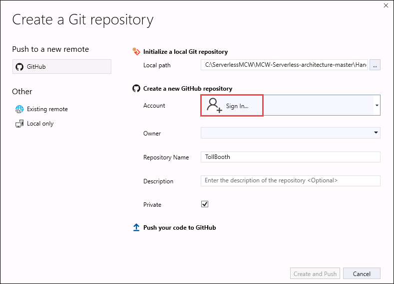
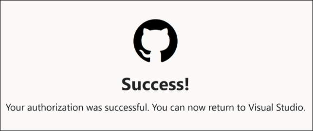
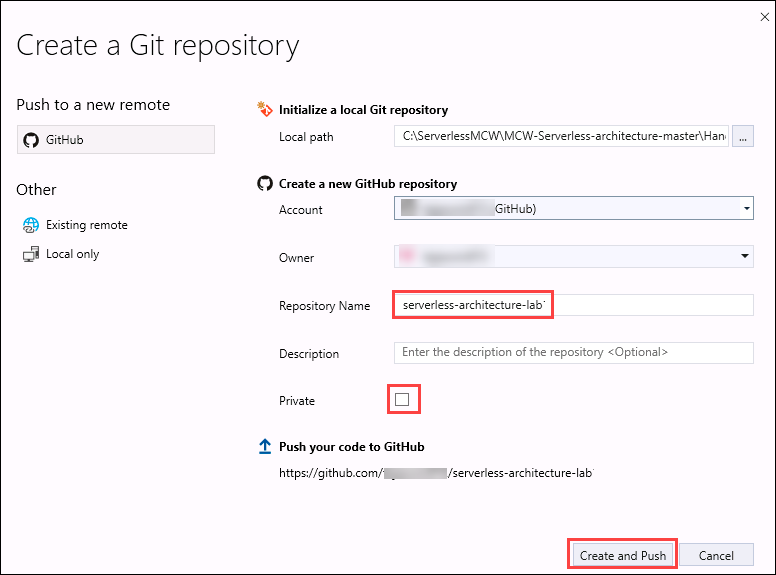
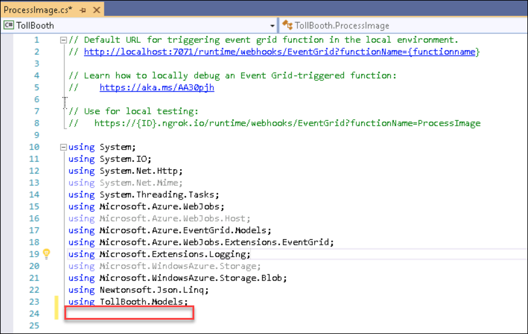
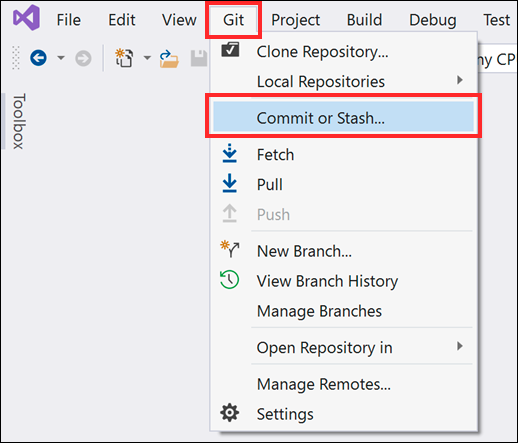
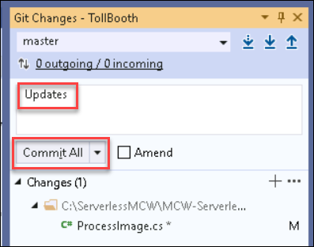
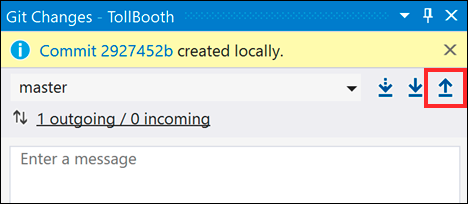
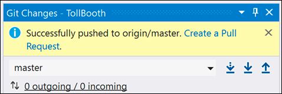
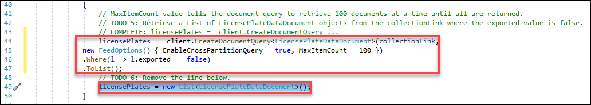
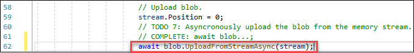

## Exercise 7: Configure continuous deployment for your Function App

**Duration**: 40 minutes

In this exercise, configure your Function App that contains the ProcessImage function for continuous deployment. You will first set up a GitHub source code repository, then set that as the deployment source for the Function App.

### Task 1: Add git repository to your Visual Studio solution and deploy to GitHub

1. Open the **TollBooth** project in Visual Studio.

2. Right-click the **TollBooth** solution in Solution Explorer, then select **Create Git Repository...**.

    

3. Click **Sign in...** next to Account under `Create a new GitHub repository`, then select **GitHub account**.

    

4. If the below web page appears, select **Authorize github** to grant Visual Studio additional permissions to work with your GitHub account.

    

5. Sign in to your GitHub account. After a few moments, you will see a Success page appear, stating that your authorization was successful. When you see this, go back to Visual Studio.

    

6. Complete the form with the following information, then click **Create and Push**:

    a. **Repository Name**: Enter `serverless-architecture-lab`, or other unique name.

    b. **Private**: Uncheck this option.

    
    
7. Open **ProcessImage.cs** from the solution explorer and add an empty line after "**using TollBooth.Models;**"
    
    
    
8. Save your changes.

9. Click the Git menu in Visual Studio, then select Commit or Stash....
    
    

10. Enter a commit message, then select **Commit All**.

    

11. After committing, select the **Push** button to push your changes to the GitHub repo.

    

    Afterward, you should see a message stating that you successfully pushed your changes to the GitHub repository.

    

12. Refresh your GitHub repository page in your browser. You should see that the project files have been added. Navigate to the **TollBooth** folder of your repo. Notice that the local.settings.json file has not been uploaded. That's because the .gitignore file of the TollBooth project explicitly excludes that file from the repository, making sure you don't accidentally share your application secrets.

    

### Task 2: Configure your Function App to use your GitHub repository for continuous deployment

1. Open the Azure Function App you created whose name ends with **FunctionApp**, or the name you specified for the Function App containing the ProcessImage function.

2. Select **Deployment Center(Classic)** underneath Deployment in the left-hand menu.

    

3. Select **GitHub** in the **Deployment Center** blade. Select **Authorize** and enter your GitHub credentials if prompted. Select **Continue**.

    

4. Select **App Service build service**, then select **Continue**.

    

5. **Choose your organization**.

6. Choose your new repository under **Choose project**. Make sure the **master branch** is selected.

    

7. Select **Continue**.

8. On the Summary page, select **Finish**.

    

9. After continuous deployment is configured, all file changes in your deployment source are copied to the function app and a full site deployment is triggered. The site is redeployed when files in the source are updated.

    

### Task 3: Finish your ExportLicensePlates function code and push changes to GitHub to trigger deployment

1. Navigate to the **TollBooth** project using the Solution Explorer of Visual Studio.

2. From the Visual Studio **View** menu, select **Task List**.

    

3. There you will see a list of TODO tasks, where each task represents one line of code that needs to be completed.

4. Open **DatabaseMethods.cs**.

5. The following code represents the completed task in DatabaseMethods.cs:

    ```csharp
        // TODO 5: Retrieve a List of LicensePlateDataDocument objects from the collectionLink where the exported value is false.
        licensePlates = _client.CreateDocumentQuery<LicensePlateDataDocument>(collectionLink,
                new FeedOptions() { EnableCrossPartitionQuery=true,MaxItemCount = 100 })
            .Where(l => l.exported == false)
            .ToList();
        // TODO 6: Remove the line below.
        licensePlates = new List<LicensePlateDataDocument>();
    ```
    

6. Make sure that you deleted the following line under TODO 6: `licensePlates = new List<LicensePlateDataDocument>();`.

7. Save your changes then open **FileMethods.cs**.

8. The following code represents the completed task in DatabaseMethods.cs:

    ```csharp
    // TODO 7: Asyncronously upload the blob from the memory stream.
    await blob.UploadFromStreamAsync(stream);
    ```
    

9. Save your changes.

10. Click the **Git** menu in Visual Studio, then select **Commit or Stash...**.

    

11. Enter a commit message, then select **Commit All**.

    

12. After committing, select the **Push** button to push your changes to the GitHub repo.

    

    Afterward, you should see a message stating that you successfully pushed your changes to the GitHub repository.

    

13. Go back to Deployment Center for your Function App in the portal. You should see an entry for the deployment kicked off by this last commit. Check the timestamp on the message to verify that you are looking at the latest one. **Make sure the deployment completes before continuing**.

    
